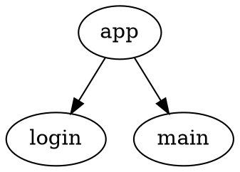

# Way

Way is a navigation library built around statechart-like node graphs.

A graph is defined in `.dot` files, and the `ru.kode.way` Gradle plugin generates:
- schema classes
- typed targets
- node builders
- child flow finish request events

The runtime (`:way`) executes transitions, keeps navigation state, and supports extension points.
The Compose integration (`:way-compose`) renders active nodes with `NodeHost`.

## Modules

- `:way` - Kotlin Multiplatform runtime library (common + JVM).
- `:way-compose` - Android Compose integration for `NavigationService`.
- `:way-gradle-plugin` - Gradle plugin (`id("ru.kode.way")`) that generates code from `.dot` schemas.
- `:sample` - KMP/JVM sample.
- `:sample-compose:*` - Android sample split into feature modules.

## Requirements

- Gradle `8.0+` (plugin checks this at apply time).
- Java toolchain 11 for project modules and plugin compilation.
- Android SDK 36 for Android modules.
- Kotlin `2.3.20`.

Notes:
- CI runs with Java 17, but modules compile to Java/Kotlin JVM 11 bytecode.
- Configuration cache is enabled in `gradle.properties`.

## Installation

### Runtime libraries

```kotlin
dependencies {
  implementation("ru.kode:way:<version>")
  implementation("ru.kode:way-compose:<version>") // optional, for Compose host
}
```

### Gradle plugin

```kotlin
plugins {
  id("ru.kode.way") version "<version>"
}
```

For Android modules that also use KSP, apply KSP plugin as usual:

```kotlin
plugins {
  id("com.google.devtools.ksp")
}
```

## Schema Files (`.dot`)

Place schema files in a sibling `way` directory next to your Kotlin sources:
- `src/main/kotlin` -> `src/main/way`
- `src/commonMain/kotlin` -> `src/commonMain/way`
- `src/commonTest/kotlin` -> `src/commonTest/way` (for KMP test generation)

Example:



### Supported graph-level attributes

- `package` - output package for generated code.
- `schemaFileName` - override generated schema file/class base name.
- `targetsFileName` - override generated targets file/class base name.

### Supported node attributes

- `type`
  - `flow` - local flow node.
  - `schema` - imported child schema flow.
  - `parallel` - parallel flow node.
- `resultType` - result type for `Finish(...)` from a flow.
- `parameterName` / `parameterType` - typed payload for that node target.

All nodes without `type` are treated as screen nodes.

## Generated Code

The plugin registers:
- `generateWayClasses`
- `generateTestWayClasses` (for `commonTest` in KMP)

Generated sources are written under:
- `build/generated/way/code/<sourceSet>/...`

Typical generated types (from graph id `App`):
- `AppSchema`
- `AppTargets` (+ `Target.Companion.app` accessor)
- `AppNodeBuilder` and nested `AppNodeBuilder.Factory`
- `AppChildFinishRequest` (sealed interface with nested child events, when child flows exist)

### How source wiring works

- KMP: generated dir is added to `commonMain` (and `commonTest` when present).
- Android: generated dir is attached to all non-test variants via Android Components API.
- Android + KSP: variant `ksp<Variant>Kotlin` tasks depend on generation and receive generated roots.
- Kotlin/JVM: generated dir is added to `main`.

## Runtime Model

Core runtime types in `:way`:
- `FlowNode<R>`, `ScreenNode`, `ParallelNode`
- `NavigationService<R>`
- `FlowTransition` / `ScreenTransition`
- `Target` (`FlowTarget`, `ScreenTarget`, `AbsoluteTarget`)

Transitions:
- `NavigateTo(targets)`
- `Finish(result)`
- `EnqueueEvent(event)`
- `Stay`
- `Ignore` (bubble to parent flow)

`NavigationService` behavior:
- `start(payload)` sends internal init event and enters root flow(s).
- Keeps `NavigationState` with per-region active/alive node paths.
- Supports node/service extension points.
- Handles queued events one-by-one after each transition.

## Compose Integration

`way-compose` provides:
- `ComposableNode` interface with `@Composable fun Content(...)`
- `NodeHost(service)` composable that:
  - auto-starts service if needed
  - observes active node
  - renders `ComposableNode`
  - applies default animated transitions

## Typical Integration Pattern

1. Add `.dot` schema file(s) under `src/*/way`.
2. Implement concrete nodes (`FlowNode`, `ScreenNode`, etc.).
3. Implement generated `*NodeBuilder.Factory` (often via DI).
4. Compose schema + node builder in a small flow object:

```kotlin
object AppFlow {
  fun nodeBuilder(component: AppFlowComponent): AppNodeBuilder =
    AppNodeBuilder(component.nodeFactory(), schema)

  val schema: AppSchema = AppSchema(
    LoginFlow.schema,
    MainFlow.schema,
  )
}
```

5. Start `NavigationService` and route events.
6. On Android Compose, render with `NodeHost(service)`.

## Build, Test, Lint

Run from repo root:

```bash
./gradlew spotlessCheck
./gradlew spotlessApply
./gradlew :way-gradle-plugin:test
./gradlew :way:jvmTest
./gradlew :sample:assemble
./gradlew :sample-compose:app:assembleDebug
```

## CI and Release

Workflows:
- `.github/workflows/ci.yml` - PR validation (Spotless + tests + sample-compose assemble matrix).
- `.github/workflows/release.yml` - publish `:way` and `:way-compose` to Maven Central on tag.
- `.github/workflows/release-plugin.yml` - publish `:way-gradle-plugin` to Gradle Plugin Portal on tag.

Tag rule for release workflows:
- tag must equal `versionName` from root `gradle.properties`
- both `<version>` and `v<version>` are accepted

## Publishing Metadata and Version

Root `gradle.properties` is the single source for:
- `versionName`
- `pomGroupId`
- POM metadata (`pomName`, `pomDescription`, licenses, SCM, developer info, etc.)

Library modules use Vanniktech Maven Publish plugin and read these properties.
Gradle plugin publication also resolves version/group from project/shared properties.

## Repository Notes

- ANTLR parser sources are generated in `:way-gradle-plugin` and excluded from Javadoc warnings.
- Dokka V2 mode is enabled (`org.jetbrains.dokka.experimental.gradle.pluginMode=V2Enabled`).
- Spotless is configured with ktlint and `@Composable` function naming allowance.
- In Android Studio, `Build -> Assemble Project` only executes tasks for selected/needed modules; if a module is not part of that task graph, its `generateWayClasses` task will not run and no generated folder will appear for that module in that build invocation.
