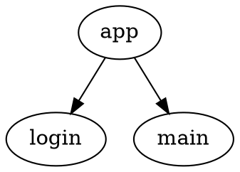
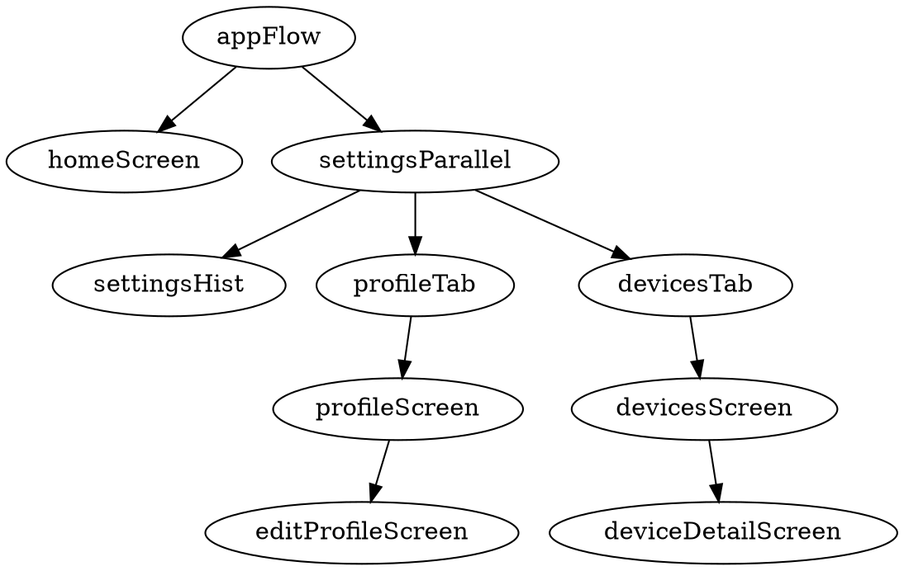

# Way

Way is a navigation library built around statechart-like node graphs.

Way's model is a Harel statechart and maps directly onto the [W3C SCXML standard](https://www.w3.org/TR/scxml/): flows are compound (OR) states, parallel nodes are parallel (AND) states, and screens are atomic states. See [Relationship to statecharts / SCXML](#relationship-to-statecharts--scxml) for the full concept mapping.

A graph is defined in `.dot` files, and the `ru.kode.way` Gradle plugin generates:
- schema classes
- typed targets
- node builders
- child flow finish request events

The runtime (`:way`) executes transitions, keeps navigation state, and supports extension points.
The Compose integration (`:way-compose`) renders active nodes with `NodeHost`.

## Modules

- `:way` - Runtime library structured as a Kotlin Multiplatform project (common + JVM). **Current release targets JVM/Android only. iOS and other native targets are planned for a future release.**
- `:way-compose` - Android Compose integration for `NavigationService`.
- `:way-gradle-plugin` - Gradle plugin (`id("ru.kode.way")`) that generates code from `.dot` schemas.
- `:sample` - JVM sample (KMP multi-target support is not yet released).
- `:sample-compose:*` - Android sample split into feature modules.

## Requirements

- Gradle `8.0+` (plugin checks this at apply time).
- Java toolchain 11 for project modules and plugin compilation.
- Android SDK 36 for Android modules.
- Kotlin `2.3.20`.

Notes:
- CI runs with Java 17, but modules compile to Java/Kotlin JVM 11 bytecode.
- Configuration cache is enabled in `gradle.properties`.

## Installation

### Runtime libraries

```kotlin
dependencies {
  implementation("ru.kode:way:<version>")
  implementation("ru.kode:way-compose:<version>") // optional, for Compose host
}
```

### Gradle plugin

```kotlin
plugins {
  id("ru.kode.way") version "<version>"
}
```

For Android modules that also use KSP, apply KSP plugin as usual:

```kotlin
plugins {
  id("com.google.devtools.ksp")
}
```

## Schema Files (`.dot`)

Place schema files in a sibling `way` directory next to your Kotlin sources:
- `src/main/kotlin` -> `src/main/way`
- `src/commonMain/kotlin` -> `src/commonMain/way`
- `src/commonTest/kotlin` -> `src/commonTest/way` (for KMP test generation)

Example:


```dot
digraph App {
  package = "ru.kode.way.sample.compose.app.routing"

  app [type=flow]
  login [type=schema, resultType = "ru.kode.way.sample.compose.login.routing.LoginFlowResult"]
  main [type=schema, resultType = "ru.kode.way.sample.compose.main.routing.MainFlowResult"]

  app -> login
  app -> main
}
```

### Supported graph-level attributes

- `package` - output package for generated code.
- `schemaFileName` - override generated schema file/class base name.
- `targetsFileName` - override generated targets file/class base name.

### Supported node attributes

- `type`
  - `flow` - local flow node.
  - `schema` - imported child schema flow.
  - `parallelFlow` - parallel flow node (all sub-regions active at once).
  - `history` / `deepHistory` - a [history pseudostate](#history-resume-across-teardown): a childless leaf declared under a plain flow or a parallel (`parentFlow -> histNodeId`). Generates a typed `HistoryTarget` accessor and is codegen-time-only (it never becomes a runtime `Schema.NodeType`).
- `resultType` - result type for `Finish(...)` from a flow.
- `parameterName` / `parameterType` - typed payload for that node target.

All nodes without `type` are treated as screen nodes.

## Generated Code

The plugin registers:
- `generateWayClasses`
- `generateTestWayClasses` (for `commonTest` in KMP)

Generated sources are written under:
- `build/generated/way/code/<sourceSet>/...`

Typical generated types (from graph id `App`):
- `AppSchema`
- `AppTargets` (+ `Target.Companion.app` accessor)
- `AppNodeBuilder` and nested `AppNodeBuilder.Factory`
- `AppChildFinishRequest` (sealed interface with nested child events, when child flows exist)
- For parallel nodes, `<ParallelName>NodeBuilder` also emits named `val <child>RegionId: RegionId` properties for each sub-region, so callers never need to hardcode `RegionId(Path(...))` strings.

### How source wiring works

- KMP: generated dir is added to `commonMain` (and `commonTest` when present).
- Android: generated dir is attached to all non-test variants via Android Components API.
- Android + KSP: variant `ksp<Variant>Kotlin` tasks depend on generation and receive generated roots.
- Kotlin/JVM: generated dir is added to `main`.

## Runtime Model

Core runtime types in `:way`:
- `FlowNode<R>`, `ScreenNode`, `ParallelFlowNode<R>`
- `NavigationService<R>`
- `FlowTransition` / `ScreenTransition` (a `ParallelFlowNode` returns `FlowTransition<R>`)
- `Target` (`FlowTarget`, `ScreenTarget`, `AbsoluteTarget`, `HistoryTarget`)

### Relationship to statecharts / SCXML

Way is a Harel statechart engine. Its runtime model corresponds directly to the
[W3C SCXML standard](https://www.w3.org/TR/scxml/) — in particular
[Appendix B, "Algorithm for SCXML Interpretation"](https://www.w3.org/TR/scxml/#AlgorithmforSCXMLInterpretation).
If you know SCXML (or UML state machines), the concepts map one-to-one:

| Way concept | SCXML / statechart concept |
|---|---|
| `FlowNode<R>` | Compound (OR) state — `<state>` with children; **exactly one** child active at a time |
| `ParallelFlowNode<R>` | Parallel (AND) state — `<parallel>`; **all** regions active simultaneously |
| `ScreenNode` | Atomic state — a leaf `<state>` with no children |
| `FlowNode.initial` | The default/initial transition of a compound state (`<initial>`) |
| Region (sub-region of a parallel node) | Orthogonal region of a `<parallel>` state |
| Set of alive paths across all regions | The active **configuration** (the set of currently active states) |
| Navigating to a deep target auto-enters every intermediate state | Entry-set computation (`computeEntrySet` = `addAncestorStatesToEnter` + `addDescendantStatesToEnter`), scoped by the LCCA |
| History node (`type="history"` / `"deepHistory"`) → `HistoryTarget` | History pseudostate (`<history>`) — restore a state's most-recently-active configuration (see [History](#history-resume-across-teardown)) |

Entering a deep target automatically enters every state on the way in: each
intermediate compound state contributes its default/initial child, and each
intermediate parallel state contributes **all** of its regions. This is exactly
SCXML's entry-set computation, bounded by the **LCCA** (Least Common Compound
Ancestor) of the transition. Way implements these standard building blocks in
`StatechartAlgorithm.kt`: `findLCCA`, `getTransitionDomain`, `computeExitSet`,
`getProperAncestors`, and `entryAncestors` (the schema-static "ancestor fill"
half of `computeEntrySet`).

#### No "focused region" in standard statecharts

In a true statechart **all parallel regions are active at the same time** —
there is no notion of a "focused", "selected", or "current" region in the
control-flow sense. Which region is *visible* is a **presentation** concern,
orthogonal to the active-state set, and Way keeps it **entirely on the app
side**: the library stores no "current region". Your `ParallelFlowNode`
subclass holds its own field (e.g. `var currentTab: RegionId`) and uses it for
both rendering (in `Content()`) and Back routing — see
[Parallel back dispatch](#parallel-back-dispatch).

**"Back" is likewise not a statechart concept**: it is layered on as a separate
navigation facet, independent of the active-state configuration.

### History (resume across teardown)

A **history pseudostate** restores the *most-recently-active* configuration of a flow or parallel
instead of its default initial. It is the SCXML `<history>` state, exposed as `HistoryTarget`.

**When to reach for it — the one thing nothing else does:** restore **all** regions of a **non-root**
parallel that was fully torn down and later re-entered. The per-region back-stack and Back only resume
a region while it is still alive; once a parallel is fully exited its alive chains are gone, so only
recorded history can bring every region's leaf back.

Declare a childless history node under the flow/parallel whose configuration you want to remember:


```dot
digraph App {
  package = "com.example"
  appFlow          [type=flow]
  homeScreen       [type=screen]
  settingsParallel [type=parallelFlow]
  settingsHist     [type="deepHistory"]     // history pseudostate for the parallel

  appFlow -> homeScreen
  appFlow -> settingsParallel
  settingsParallel -> settingsHist
  settingsParallel -> profileTab -> profileScreen -> editProfileScreen
  settingsParallel -> devicesTab -> devicesScreen -> deviceDetailScreen
}
```

The plugin generates a typed accessor in the enclosing flow's `Targets` class, whose path points at the
remembered flow/parallel (segment ids elided for readability):

```kotlin
// AppTargets
val settingsHist: HistoryTarget =
  HistoryTarget(Path([appFlow, settingsParallel]), deep = true)
```

Use it in a transition like any other target:

```kotlin
// appFlow's FlowNode
override fun transition(event: Event) = when (event) {
  is OpenSettings -> NavigateTo(Target.appFlow.settingsHist)  // resume Settings where the user left off
  else -> Ignore
}
```

Suppose the user drills `profileTab → editProfile` **and** `devicesTab → deviceDetail`, then backs all
the way out to Home — `settingsParallel` is fully destroyed. Re-opening:

- `NavigateTo(Target.appFlow.settingsParallel)` (a plain `FlowTarget`) **resets both tabs to their
  defaults** (`profileScreen`, `devicesScreen`).
- `NavigateTo(Target.appFlow.settingsHist)` (deep history) **restores both tabs at once** —
  `editProfileScreen` *and* `deviceDetailScreen`. On the very first visit, with nothing recorded yet, it
  falls back to the default initial, exactly like a `FlowTarget`.

**Shallow vs deep** (`type="history"` vs `type="deepHistory"`) differ only when the remembered child has
deeper state of its own:

```dot
onboarding -> wizard -> step1   // step1 is the default
wizard -> step2
```

If the user was on `wizard/step2` when `onboarding` was torn down, then re-entering via history:

- `type="deepHistory"` restores `wizard/step2` — the exact leaf you were on.
- `type="history"` (shallow) restores `wizard` but re-enters it at its default `step1` — it remembers
  *which* child was active, not how deep you had gone.

They coincide when the child is a plain screen (nothing deeper to forget). For a **parallel**, deep
history restores every region's exact leaf, whereas shallow re-enters every region at its default (close
to a plain `FlowTarget`) — so for "resume the tabs exactly where I left off", reach for `deepHistory`.

**When you don't need it.** A **root** parallel (e.g. a bottom-nav bar that is never torn down) already
keeps every tab alive, so the back-stack resumes each tab for free — no history required. Flows you
re-compose explicitly (see [Backing out of a cross-tab jump](#backing-out-of-a-cross-tab-jump)) don't
need it either. Reach for history only for the genuine tear-down-and-return case above.

### Parallel back dispatch

Parallel regions are all active at once, so Back must target **one** of them. Since "which region the user is looking at" is presentation state the library doesn't store, the parallel node decides in its ordinary `transition(Event.Back)`:

- return `DispatchBackTo(regionId)` to route the structural back-pop into that region (supply the region from your own field);
- return `Stay` to swallow Back, or `Finish(...)` / `NavigateTo(...)` to redirect;
- return `Ignore` (the default) and Back goes to the **deepest** active region.

```kotlin
// Tab bar: Back goes within the selected tab. The app owns "current tab".
class MainTabsNode : ParallelFlowNode<Unit>(), ComposableNode {
  var currentTab: RegionId by mutableStateOf(homeRegionId); private set

  override fun transition(event: Event) = when (event) {
    is TabSelected     -> { currentTab = event.regionId; Stay }  // update own field
    is Event.Back      -> DispatchBackTo(currentTab)             // route Back via own field
    is LogoutRequested -> Finish(Unit)
    else -> Ignore
  }
}
```

Pass a `RegionId` from `NavigationState.regions` keys or a generated `<Schema>.<child>RegionId` constant. A `DispatchBackTo` naming a region that is no longer alive is **not** an error — Back soft-falls-back to the deepest active region, so the back button never crashes.

Transitions:
- `NavigateTo(targets)`
- `Finish(result)`
- `EnqueueEvent(event)`
- `NavigateAndEnqueue(navigate, events)` — a `NavigateTo` plus follow-up events (build with `navigateTo thenEnqueue event`)
- `DispatchBackTo(regionId)` — from a `ParallelFlowNode`, route a Back-press into `regionId` (see [Parallel back dispatch](#parallel-back-dispatch))
- `Stay`
- `Ignore` (bubble to parent flow)

#### Backing out of a cross-tab jump

A common tab-bar pattern: from tab A the user deep-jumps into a screen owned by tab B, then presses
Back expecting to both **pop** it in region B **and** return to tab A. Because presentation is
app-side, you drive it from the parallel node — track `currentTab` yourself, cross regions with
explicit `AbsoluteTarget`s, and compose two hops:

```kotlin
var currentTab: RegionId by mutableStateOf(tabARegionId); private set

override fun transition(event: Event): FlowTransition<Unit> = when (event) {
  // Hop 1: pop the deep screen in region B (still the current tab), then hand off to hop 2.
  BackFromDeepScreen ->
    NavigateTo(AbsoluteTarget(tabBHomePath)) thenEnqueue ReturnToTabA(event.target)

  // Hop 2: switch the app's tab to A and navigate A to the target.
  is ReturnToTabA -> {
    currentTab = tabARegionId
    NavigateTo(AbsoluteTarget(tabATargetPath))
  }
  else -> Ignore
}
```

The app updates `currentTab` itself; the library stores nothing. Cross-region targets are absolute
(explicit) rather than resolved against a "focused" region. If tab A should simply be restored as the
user left it, hop 2 collapses to `{ currentTab = tabARegionId; Stay }`. Note the region-B pop is a
`NavigateTo(AbsoluteTarget(tabBHomePath))`, which **resets** region B to that screen rather than
popping exactly one entry — fine when the deep screen sits directly on tab B's home, but be aware it
also drops any intermediate screens.

`NavigationService` behavior:
- `start(payload)` sends internal init event and enters root flow(s).
- Keeps `NavigationState` with per-region active/alive node paths.
- Supports node/service extension points.
- Handles queued events one-by-one after each transition.

## Compose Integration

`way-compose` provides:
- `ComposableNode` interface with `@Composable fun Content(modifier: Modifier)`
- A `ParallelFlowNode` renders by implementing `ComposableNode` — its `Content()` lays out the parallel and calls `NodeHost(regionId)` inside it to render each sub-region's screen stack.
- `LocalNavigationService` — `CompositionLocal<NavigationService<*>>` provided by `NodeHost(service)`. Available inside any `Content()` for reading state or sending events.
- `NodeHost(service)` composable — auto-starts service, observes root region's active node, renders `ComposableNode.Content()`, applies animated transitions.
- `NodeHost(regionId)` composable — renders the active screen in a specific sub-region. Call from a parallel node's `Content()` for each sub-region. Requires a parent `NodeHost(service)` to have provided `LocalNavigationService`.

Parallel node example (tab bar with state preservation):

```kotlin
class MainTabsNode : ParallelFlowNode<Unit>(), ComposableNode {
  override val dismissResult = Unit
  // homeRegionId / exploreRegionId come from generated MainTabsSchema constants.
  // The app owns "current tab" — the library stores nothing.
  var currentTab: RegionId by mutableStateOf(homeRegionId); private set

  override fun transition(event: Event) = when (event) {
    is TabSelected -> { currentTab = event.regionId; Stay }  // update own field
    is Event.Back  -> DispatchBackTo(currentTab)             // Back follows the visible tab
    else -> Ignore
  }

  @Composable
  override fun Content(modifier: Modifier) {
    val regionIds = listOf(homeRegionId, exploreRegionId)
    Scaffold(modifier, bottomBar = { TabBar(selected = currentTab) }) { padding ->
      // Render all regions simultaneously: state is preserved across tab switches
      regionIds.forEach { regionId ->
        key(regionId) {
          Box(if (regionId == currentTab) Modifier.padding(padding) else Modifier.size(0.dp)) {
            NodeHost(regionId)
          }
        }
      }
    }
  }
}
```

## Building a UI integration

The `:way` runtime is UI-agnostic — it contains no rendering code and no UI-framework
dependencies. `way-compose` is a *reference implementation* of a pluggable UI module, not a
privileged one: everything it does goes through the public API of `:way`, so an integration for
another UI framework (Android Views, SwiftUI, desktop, …) can be built the same way as a separate
`way-view`-style module, with zero changes to the core.

This mirrors the SCXML heritage: the statechart standard deliberately has no presentation
concept, so all rendering lives outside the core, in per-framework modules.

### The core contract

A UI integration needs only these public APIs:

- **Observe**: `service.addTransitionListener { state: NavigationState -> ... }` — called with the
  new state after every committed transition (remove the listener with `removeTransitionListener`
  when the host is torn down). Call `service.start()` on first attach (guard with `isStarted()`).
- **Read what to render**:
  - `state.regions[regionId].active` / `.activeNode` — the currently active leaf of each region;
    this is the node to render for that region.
  - `state.rootNode` / `state.rootNodePath` — non-null only when the schema's root is a
    `ParallelFlowNode` (it owns no region of its own; its sub-regions live one level deeper).
    Render this node's container chrome at the top and host each sub-region inside it.
- **Tear down**: `service.cleanDispose()` (fires `onDispose()` leaf-to-root and clears listeners)
  when the host owns the service and leaves; plain hosts just remove their listener.

### The pattern every UI module follows

`way-compose` demonstrates the three pieces an integration provides:

1. **A render opt-in interface** for the framework — `way-compose` has
   `ComposableNode { @Composable fun Content(modifier) }`; a hypothetical `way-view` would have
   e.g. `ViewNode { fun createView(context: Context): View }`. Node classes opt into rendering by
   implementing it; the runtime never sees this interface.
2. **A host** that observes the service and renders each region's active node when it implements
   the opt-in (`NodeHost(service)` in `way-compose`).
3. **A per-region host** so a parallel node's chrome can mount each of its sub-regions
   (`NodeHost(regionId)` in `way-compose`).

### Why the parallel node renders its own chrome

A regular `FlowNode` (an OR-state) shows exactly one child at a time — there is nothing for it to
lay out, so it stays headless. A `ParallelFlowNode` (an AND-state) has all sub-regions active
simultaneously, which raises a question only presentation can answer: *how do N regions share the
screen* — tabs, side-by-side panes, an overlay sheet? That layout decision belongs to the app, so
the parallel node's subclass provides it through the UI module's opt-in interface, exactly the way
screens do. Routing (`transition()`) stays UI-independent either way.

### Keeping node classes UI-framework-free

If your node classes must not depend on any UI framework (shared routing modules, KMP), hold
presentation state such as the selected tab in a UI-neutral observable — e.g.
`MutableStateFlow<RegionId>` (`:way` already uses kotlinx-coroutines) instead of Compose's
`mutableStateOf` — and keep the framework-specific rendering in a module above the routing one.
The field itself stays on the node either way, because `transition(Event.Back)` uses it for
`DispatchBackTo(currentTab)`.

## Typical Integration Pattern

1. Add `.dot` schema file(s) under `src/*/way`.
2. Implement concrete nodes (`FlowNode`, `ScreenNode`, etc.).
3. Implement generated `*NodeBuilder.Factory` (often via DI).
4. Compose schema + node builder in a small flow object:

```kotlin
object AppFlow {
  fun nodeBuilder(component: AppFlowComponent): AppNodeBuilder =
    AppNodeBuilder(component.nodeFactory(), schema)

  val schema: AppSchema = AppSchema(
    LoginFlow.schema,
    MainFlow.schema,
  )
}
```

5. Start `NavigationService` and route events.
6. On Android Compose, render with `NodeHost(service)`.

## Build, Test, Lint

Run from repo root:

```bash
./gradlew spotlessCheck
./gradlew spotlessApply
./gradlew :way-gradle-plugin:test
./gradlew :way:jvmTest
./gradlew :sample:assemble
./gradlew :sample-compose:app:assembleDebug
```

## CI and Release

Workflows:
- `.github/workflows/ci.yml` - PR validation (Spotless + tests + sample-compose assemble matrix).
- `.github/workflows/release.yml` - publish `:way` and `:way-compose` to Maven Central on tag.
- `.github/workflows/release-plugin.yml` - publish `:way-gradle-plugin` to Gradle Plugin Portal on tag.

Tag rule for release workflows:
- tag must equal `versionName` from root `gradle.properties`
- both `<version>` and `v<version>` are accepted

## Publishing Metadata and Version

Root `gradle.properties` is the single source for:
- `versionName`
- `pomGroupId`
- POM metadata (`pomName`, `pomDescription`, licenses, SCM, developer info, etc.)

Library modules use Vanniktech Maven Publish plugin and read these properties.
Gradle plugin publication also resolves version/group from project/shared properties.

## Repository Notes

- ANTLR parser sources are generated in `:way-gradle-plugin` and excluded from Javadoc warnings.
- Dokka V2 mode is enabled (`org.jetbrains.dokka.experimental.gradle.pluginMode=V2Enabled`).
- Spotless is configured with ktlint and `@Composable` function naming allowance.
- In Android Studio, `Build -> Assemble Project` only executes tasks for selected/needed modules; if a module is not part of that task graph, its `generateWayClasses` task will not run and no generated folder will appear for that module in that build invocation.
